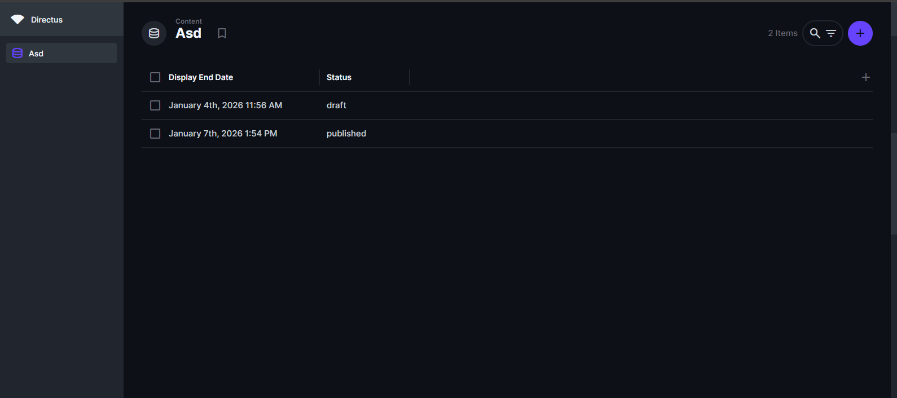

# Directus Extensions: Display End Date & Filter Expired Posts

This repository contains two complementary Directus extensions that work together to manage time-sensitive content: a **Display End Date Interface** that provides a date picker (time optional) for setting when content should expire, and a **Filter Expired Posts Hook** that automatically changes expired published items to draft and excludes them from responses.

## Why It's Useful

Managing time-sensitive content like blog posts, news articles, promotional campaigns, or event listings requires controlling when content should stop being displayed. Manually tracking expiration dates and adding filters to every API query is time-consuming and error-prone. These extensions solve this problem by providing a complete solution: the interface extension allows content creators to easily set expiration dates with visual feedback, while the hook extension automatically handles filtering at the API level, ensuring expired content never appears in your applications without requiring any changes to your frontend code or API queries.

## How to Install/Use It

### Installation

1. **Clone this repository:**
   ```bash
   git clone <repository-url>
   cd directus-extensions
   ```

2. **Install and build Display End Date Interface:**
   ```bash
   cd extensions/interfaces/display-end-date
   npm install
   npm run build
   ```

3. **Install and build Filter Expired Posts Hook:**
   ```bash
   cd ../hooks/filter-expired-posts
   npm install
   npm run build
   ```

4. **(Optional) bundle auto-load:** Place the provided extensions/package.json file into the extensions/ directory of your Directus project so Directus loads both the interface and the hook as a bundle.

5. **Restart Directus** (to ensure the extensions are loaded).

### Usage

#### Step 1: Setup Display End Date Field

1. Open Directus Admin Panel
2. Go to **Settings** → **Data Model**
3. Select your collection (e.g., `posts`)
4. Click **Create Field**
5. Configure the field:
  Field Name: display_end_date
  Field Type: Date (recommended), or DateTime / Timestamp if you also need time
  Interface: Select "Display End Date"
  Options:
  Include Time: optional (default OFF, enable if you need hours/minutes)
  Save

#### Step 2: Use the Interface

1. When creating or editing items, use the **Display End Date** field
2. Click the date/time picker to select when content should expire
3. If you select a date in the past, a warning will appear
4. Leave empty if content should never expire

Step 3: Automatic status change & filtering
When the hook is loaded:
It automatically detects the display_end_date field
On any items read request (list/detail), published items with display_end_date earlier than today will have their status changed to draft in the database
The response payload will no longer contain expired items (because they’ve been moved to draft)
You can verify the hook is running via logs:
docker compose logs directus | Select-String -Pattern "filter-expired-posts"

### Example API Usage

The hook works automatically - no special query needed:

```javascript
// Simple query - expired posts are automatically filtered
const posts = await directus.request(
  readItems('posts', {
    filter: {
      status: { _eq: 'published' }
    }
  })
);
```

## Features & Screenshots

### Before & After Comparison

The following screenshots demonstrate how these extensions improve content management for time-sensitive posts:

#### Before: Without Extensions


*Without the extensions, there's no way to set display end dates, and expired content continues to appear in API responses, requiring manual filtering in every query.*

**Problems:**
- No interface to set expiration dates
- Expired content still appears in API queries
- Manual filtering required in frontend code
- Risk of showing outdated content to users

#### After: With Extensions


*With both extensions installed, content creators can easily set display end dates using the intuitive date picker interface, and expired posts are automatically filtered out from API responses without any code changes.*

**Solutions:**
- ✅ **Display End Date Interface** provides an easy-to-use date/time picker
- ✅ Visual warning when expired dates are selected
- ✅ **Filter Expired Posts Hook** automatically filters expired content at API level
- ✅ No frontend code changes required
- ✅ Expired published items automatically change to draft status
- ✅ Prevents outdated content from appearing in applications

### Key Features Demonstrated

1. **Intuitive Date Picker**: The Display End Date interface makes it simple to set when content should expire
2. **Automatic Filtering**: The hook extension works behind the scenes to ensure expired content never reaches your frontend
3. **Visual Feedback**: Warning messages help content creators identify expired dates immediately
4. **Zero Configuration**: Once installed, the extensions work automatically without additional setup

## Requirements

- Directus 10.1.0+ or 11.0.0+
- Node.js 18+

## Extension Details

### Display End Date Interface
- **Type:** Interface Extension
- **Location:** `extensions/interfaces/display-end-date/`
- **Documentation:** [View Details](./extensions/interfaces/README.md)

### Filter Expired Posts Hook
- **Type:** API Hook Extension
- **Location:** `extensions/hooks/filter-expired-posts/`
- **Documentation:** [View Details](./extensions/hooks/filter-expired-posts/README.md)

## License

MIT
